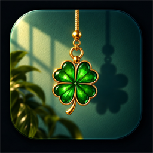

<div align="center">



# Hangly for Windows

**A tiny piece of motion for your Windows desktop.**

A charm hangs from your screen edge or taskbar on a simulated golden rope. Nudge it and it swings, carries momentum, and settles — powered by authentic 240 Hz Verlet physics, not a canned loop.

<br>

[](#requirements)
[](#requirements)
[](LICENSE)

</div>

---

## What It Is

Hangly puts one small, beautiful object on your screen and refuses to fake it. The cord is a twenty-segment Verlet rope solved at a fixed 240 Hz. Grab the charm, throw it, and the momentum you gave it is the momentum it keeps.

It lives unobtrusively on your desktop, has no taskbar clutter, features a dedicated system tray icon, and goes to sleep when stationary (< 0.1% CPU when settled) — waking instantly the millisecond you interact with it.

---

## Features

### 🪢 100% Native Windows Overlay (`Hangly.exe`)
- **Zero-Dependency Standalone Executable**: Built with native Windows Forms / GDI+ on .NET Framework 4.0+. Runs immediately on any Windows 10 or 11 system without installing extra runtimes.
- **Dynamic Click-Through (`WM_NCHITTEST`)**: The transparent background passes all clicks directly to whatever window is behind it with 0ms latency. You can effortlessly click browser tabs, address bars, and window control buttons (**Close `✕`**, Minimize, Maximize) directly behind the hanging overlay.
- **High-Visibility Golden Silk Cord**: Styled with an amber contour border, vibrant radiant gold core, and specular spiral twist braid so the cord stands out sharply against any light or dark window and wallpaper.

### 🍀 17 Handcrafted Charms
- **Lucky Four-Leaf Clover** (*Featured*): Radiant emerald crystal in a polished gold frame with glassmorphism sheen.
- **Daruma** (*Japan*): Bodhidharma perseverance wish doll.
- **Nazar boncuğu** (*Mediterranean*): Traditional cobalt and turquoise evil-eye talisman.
- **Hamsa** (*Middle East*): Protective hand with palm eye.
- **Nimbu-mirchi** (*India*): Sacred lemon and green chillies.
- **Ghanta** (*India*): Sacred temple bell.
- **Drishti bommai** (*South India*): Fierce guardian mask.
- **Pánchángjié** (*China*): Endless knot for Lunar New Year.
- **Maneki-neko** (*Japan*): Beckoning fortune cat.
- **Horseshoe** (*Europe/Americas*): Lucky blacksmith iron shoe.
- **Scarab** (*Ancient Egypt*): Turquoise dung beetle amulet.
- **Himmeli** (*Finland*): Geometric rye straw mobile.
- **Classic Geometric Shapes**: Glass Bead, Retro Camera, Lucky Star, Crimson Heart, and Ice Diamond.

### ⚙️ All Hang Modes
1. **Top-Right (Default)**: Pinned cleanly to your primary display's top-right screen corner.
2. **Top-Center**: Pinned beneath the top center of the screen (notch / camera style).
3. **Top-Left**: Pinned to the top-left screen corner.
4. **Windows Taskbar Hang**: Specifically engineered for Windows! Suspends the charm right above your taskbar.
5. **Ambient Breeze**: Gentle organic wind gusts causing the rope to sway peacefully.
6. **Hypnotic Pendulum**: Smooth continuous harmonic oscillation.
7. **Bouncy Elastic**: Enhanced spring compliance for playful bounce dynamics.
8. **Interactive Magnetic**: Charm subtly leans toward and tracks your cursor when nearby.

### 🌐 Full Web Studio & Simulator
An integrated local web application (`http://localhost:3030`) featuring:
- Live 240 Hz Verlet canvas simulator.
- Real-time physics tuning (gravity, damping, rope length, tension).
- **AI Charm Studio**: Drop any image (PNG, JPG, WebP, SVG) to remove its background, tune mass, and hang it on the rope.
- Procedural Web Audio synthesizer for material collision sounds (wood, metal, glass, bell, soft).

---

## Quick Start

### Running the App
1. **Direct Executable**:
   Double-click `Hangly.exe`. The charm immediately hangs from your screen corner.
2. **Desktop Shortcut**:
   Run `Create-Desktop-Shortcut.bat` to place a convenient `Hangly` shortcut on your Windows desktop.
3. **All-in-One Launcher**:
   Double-click `Run-Hangly-Windows.bat` to start the desktop overlay and launch the Web Studio in your browser simultaneously.

### Mouse Interactions
- **Left-Click & Drag**: Grab the charm to swing, stretch, or fling it with momentum across your screen.
- **Double-Click**: Flick the charm to start a natural oscillation.
- **Right-Click Charm or Tray Icon**: Open the quick-switch menu to change charms, hang modes, scale (80% to 150%), or exit.

---

## Building from Source

To compile `Hangly.exe` from source on Windows:

```cmd
build.bat
```

Or using the .NET C# compiler directly:

```cmd
C:\Windows\Microsoft.NET\Framework64\v4.0.30319\csc.exe /target:winexe /out:"Hangly.exe" /win32icon:"Hangly.ico" /r:System.Windows.Forms.dll,System.Drawing.dll,System.dll,Microsoft.CSharp.dll "src\HanglyApp.cs"
```

To run the Web Studio:

```cmd
npm install
npm start
```

---

## Project Structure

```
Hangly-for-Windows/
├── Hangly.exe                 # Compiled native Windows executable
├── Hangly.ico                 # Multi-resolution application icon
├── build.bat                  # One-click Windows build script
├── Run-Hangly-Windows.bat     # Windows launcher (App + Web Studio)
├── Create-Desktop-Shortcut.bat# Desktop shortcut installer
├── src/
│   └── HanglyApp.cs           # Pure C# native Windows overlay & physics engine
├── public/                    # Web Studio frontend (HTML, CSS, JS, Assets)
│   ├── assets/                # SVGs, previews, and icons
│   └── js/                    # Physics, charms, audio, and studio controllers
├── server.js                  # Express & WebSocket bridge server
├── hangly_desktop.py          # Standalone Python/Tkinter alternative
└── LICENSE                    # MIT License
```

---

## License

This project is open source and available under the [MIT License](LICENSE).
